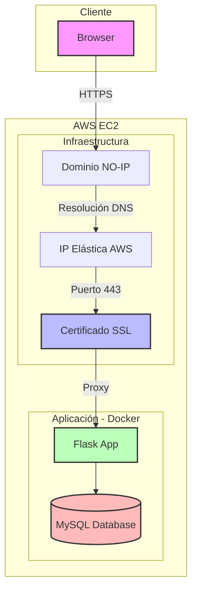

# Bookstore E-commerce - Versión Monolítica

Esta es una aplicación de comercio electrónico de libros implementada como una arquitectura monolítica. La aplicación está diseñada para ser desplegada en una instancia de AWS EC2, utilizando un dominio personalizado con certificado SSL y un proxy inverso para manejar las conexiones seguras.

## Diagrama de Arquitectura



## Características Principales

- Arquitectura monolítica que integra todos los componentes en una sola aplicación
- Despliegue en AWS EC2
- Dominio personalizado con certificado SSL
- Proxy inverso para manejo seguro de conexiones
- Base de datos MySQL
- Desarrollada con Python y Flask

## Requisitos Previos

- Una instancia EC2 en AWS
- Un dominio registrado y configurado para apuntar a tu instancia EC2
- Acceso SSH a la instancia
- Python y pip instalados
- MySQL instalado

## Proceso de Despliegue

### 1. Configuración del Dominio

Primero que nada, asegurate de tener un dominio registrado en NO-IP Domain y configurado para apuntar a tu instancia EC2.

Crea una **IP Elástica** en AWS para que puedas tener una IP fija apuntando a tu dominio.

### 2. Configuración del Servidor

```bash
sudo apt update
sudo apt install docker.io -y
sudo apt install docker-compose -y

sudo systemctl enable docker
sudo systemctl start docker
```

### 3. Configuración del Certificado SSL

Primero que nada, asegurate de abrir los puertos 80 y 443 en el firewall de tu instancia EC2.

```bash
# Instalar Certbot
sudo snap install core && sudo snap refresh core
sudo snap install --classic certbot
sudo ln -s /snap/bin/certbot /usr/bin/certbot

# Obtener certificado SSL (reemplaza 'tu-dominio.com' con tu dominio)
sudo certbot certonly --standalone -d tu-dominio.com
# Sigue los pasos que te indica el comando
```

Asegúrate de que el certificado SSL esté en `/etc/letsencrypt/live/tu-dominio.com/`.

### 4. Despliegue de la aplicación

```bash
git clone https://github.com/alejoriosm04/bookstore-ecommerce.git
cd bookstore-ecommerce
sudo docker-compose -f docker-compose.yml up -d
```

## Mantenimiento

### Renovación del Certificado SSL

El certificado SSL se renueva automáticamente cada 90 días. Para verificar el estado:

```bash
sudo certbot certificates
```

Para renovar manualmente:

```bash
sudo certbot renew
```
