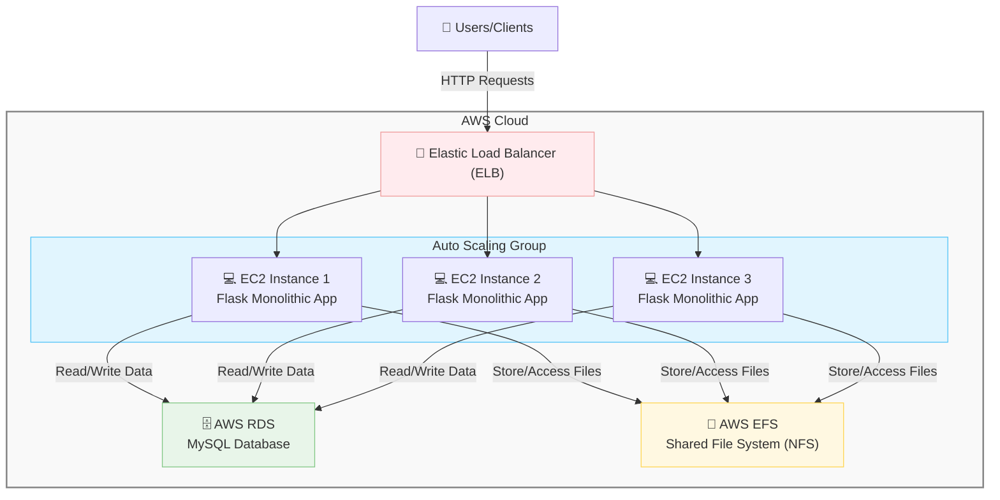

## ST0263 Tópic. Espec. en Telemática - Proyecto 2

### Integrantes

- Alejandro Ríos Muñoz - ariosm@eafit.edu.co
- Lina Sofía Ballesteros Merchán - lsballestm@eafit.edu.co
- Jhonnatan Stiven Ocampo Díaz - jsocampod@eafit.edu.co

### Profesor

- Edwin Nelson Montoya Munera - emontoya@eafit.edu.co

### 1. Descripción del proyecto

Esta es una aplicación de comercio electrónico de libros implementada como una arquitectura monolítica. La aplicación está diseñada para ser desplegada en una instancia de AWS EC2, siguiendo un patrón de escalamiento de apps monolíticas. La aplicación implementa un sistema de Máquinas Virtuales (VM) con autoescalamiento, base de datos MySQL administrada por AWS RDS, un sistema de archivos compartidos vía NFS en un servicio de AWS EFS y un balanceador de carga (ELB) para distribuir el tráfico entre las instancias de la aplicación.

### 2. Información general

#### 2.1 Diseño de alto nivel
El sistema está compuesto por los siguientes componentes:
- Aplicación Monolítica (Flask): Implementa totalmente la lógica de la aplicación de comercio electrónico de libros.
- Base de datos (MySQL): Almacena los datos de los libros, usuarios y órdenes.
- Sistema de archivos compartidos (NFS): Permite el acceso compartido a los archivos de la aplicación entre las instancias de la aplicación.
- Balanceador de carga (ELB): Distribuye el tráfico entre las instancias de la aplicación.
- Máquinas virtuales (VM) con autoescalamiento: Permiten el escalamiento horizontal de la aplicación.



#### 2.2 Arquitectura

La arquitectura implementada es un sistema monolítico escalable horizontalmente, donde una única aplicación Flask contiene toda la lógica de negocio del comercio electrónico de libros. 

Esta aplicación se despliega en múltiples instancias EC2 dentro de un grupo de auto-escalamiento, permitiendo ajustar automáticamente la capacidad según la demanda. Un balanceador de carga (ELB) distribuye el tráfico entrante entre estas instancias, mejorando la disponibilidad y rendimiento. 

La persistencia de datos se centraliza en una base de datos MySQL gestionada por AWS RDS, mientras que un sistema de archivos compartido implementado con AWS EFS garantiza que todas las instancias accedan a los mismos recursos estáticos. Esta arquitectura mantiene la simplicidad de un monolito mientras ofrece escalabilidad y alta disponibilidad propias de sistemas distribuidos.


#### 2.3 Patrones de diseño
- **Escalamiento horizontal:** Múltiples instancias EC2 de la misma aplicación.
- **Base de datos compartida:** Centralización de datos en MySQL (AWS RDS).
- **Balanceo de carga:** Uso de ELB para distribuir tráfico.
- **Aplicación sin estado:** Cualquier instancia puede manejar cualquier solicitud.
- **Sistema de archivos compartido:** Uso de EFS para compartir recursos estáticos.

#### 2.4 Buenas prácticas utilizadas
- **Auto-escalamiento:** Ajuste automático de capacidad según demanda.
- **Servicios gestionados:** Uso de servicios administrados de AWS (RDS, EFS, ELB).
- **Alta disponibilidad:** Mediante múltiples instancias y balanceo de carga.
- **Modularización del código:** Organización estructurada del código dentro del monolito.
- **Persistencia centralizada:** Base de datos única para acceso consistente a datos.

### 3. Descripción del ambiente de desarrollo y técnico
#### 3.1 Lenguajes y tecnologías principales


| Componente           | Tecnología         | Versión               |
|----------------------|--------------------|------------------------|
| Aplicación Monolítica| Flask (Python)     | 3.1.0                  |
| Base de datos        | MySQL (AWS RDS)    | 8.0                    |
| Sistema de archivos  | NFS (AWS EFS)      | Servicio gestionado    |
| Balanceador de carga | AWS ELB            | Servicio gestionado    |
| Auto-escalamiento    | AWS Auto Scaling   | Servicio gestionado    |
| Infraestructura      | AWS EC2            | t2.medium              |
| Sistema Operativo    | Ubuntu             | 22.04 LTS              |
| Contenedorización    | Docker             | 24.0.5                 |


#### 3.2 Detalles del desarrollo
La arquitectura implementada es un sistema monolítico escalable horizontalmente, donde una única aplicación Flask contiene toda la lógica de negocio del comercio electrónico de libros. 

#### 3.3 Estructura del proyecto
```bash
.
├── Dockerfile
├── README.md
├── app.py
├── config.py
├── controllers
├── docker-compose.yml
├── extensions.py
├── instance
├── models
├── requirements.txt
├── static
└── templates

```
### 4. Despliegue del Proyecto en AWS


### 4. Despliegue del Proyecto en AWS

Para desplegar nuestra aplicación monolítica escalable en AWS, es necesario seguir estos pasos detallados:

#### 4.1 Configuración de la infraestructura

1. **Crear un grupo de seguridad (Security Group)** con los siguientes puertos:
   * HTTP (80) - Para tráfico web
   * HTTPS (443) - Para tráfico web seguro
   * SSH (22) - Para administración remota
   * TCP (3306) - Para MySQL
   * TCP (2049) - Para NFS (EFS)

2. **Crear un sistema de archivos EFS**:
   * Crear un nuevo sistema de archivos EFS en la consola de AWS
   * Configurar los puntos de montaje en las mismas zonas de disponibilidad donde se desplegarán las instancias EC2
   * Configurar el grupo de seguridad para permitir el tráfico NFS desde las instancias EC2

3. **Configurar la base de datos RDS MySQL**:
   * Crear una instancia de MySQL en RDS con configuración Multi-AZ para alta disponibilidad
   * Configurar el grupo de seguridad para permitir conexiones desde las instancias EC2
   * Crear la base de datos inicial y los esquemas necesarios para la aplicación

#### 4.2 Configuración del Auto Scaling y Load Balancing

1. **Crear una AMI personalizada**:
   * Lanzar una instancia EC2 inicial con Ubuntu 22.04 LTS
   * Instalar Docker y dependencias necesarias
   * Configurar el montaje automático del sistema de archivos EFS en el directorio /mnt/efs
   * Instalar y configurar el agente de CloudWatch para monitoreo
   * Clonar el repositorio y configurar la aplicación
   * Crear un script de inicio que ejecute la aplicación al arrancar la instancia
   * **Importante**: Crear una AMI a partir de esta instancia configurada utilizando "Create Image" en la consola EC2
   * Anotar el ID de la AMI para utilizarla en la plantilla de lanzamiento

2. **Configurar certificados SSL**:
   * Acceder a AWS Certificate Manager (ACM)
   * Solicitar un nuevo certificado público para el dominio de la aplicación
   * Completar la validación del dominio (vía DNS o correo electrónico)
   * Anotar el ARN del certificado para utilizarlo en el balanceador de carga

3. **Configurar el balanceador de carga**:
   * Crear un Application Load Balancer (ALB) con oyentes HTTP y HTTPS
   * Configurar el listener HTTPS (puerto 443) utilizando el certificado SSL de ACM
   * Configurar redirección desde HTTP a HTTPS para todo el tráfico
   * Configurar los grupos de destino (target groups) para las instancias EC2
   * Configurar health checks para verificar el estado de las instancias

4. **Configurar el grupo de Auto Scaling**:
   * Crear una plantilla de lanzamiento utilizando la AMI personalizada creada anteriormente
   * Especificar el tipo de instancia (t2.medium recomendado)
   * Configurar los datos de usuario para montar EFS y arrancar la aplicación
   * Crear un grupo de Auto Scaling utilizando esta plantilla
   * Establecer la capacidad mínima, deseada y máxima de instancias (por ejemplo, 2-5 instancias)
   * Configurar políticas de escalado basadas en métricas como CPU, memoria o número de solicitudes
   * Asociar el grupo de Auto Scaling con el balanceador de carga

#### 4.3 Despliegue de la aplicación

1. **Preparar la aplicación para el despliegue**:
   * Asegurar que el archivo config.py esté configurado para conectarse a la base de datos RDS
   * Configurar la aplicación para almacenar archivos estáticos en EFS (/mnt/efs/static)
   * Ajustar cualquier variable de entorno necesaria para el entorno de producción

2. **Verificar el despliegue**:
   * Confirmar que la aplicación esté funcionando visitando la dirección DNS del balanceador de carga
   * Verificar que la conexión HTTPS esté correctamente configurada (candado verde en el navegador)
   * Comprobar que la redirección de HTTP a HTTPS funcione correctamente
   * Verificar que el Auto Scaling funcione correctamente aumentando artificialmente la carga
   * Validar que todas las instancias puedan acceder a los mismos archivos estáticos a través de EFS
   * Comprobar que la base de datos esté correctamente conectada y funcional

#### 4.4 Configuración de DNS y Route 53 (opcional)

1. **Configurar Route 53**:
   * Crear una zona alojada para el dominio si aún no existe
   * Crear un registro A de alias que apunte al balanceador de carga
   * Confirmar que el dominio resuelve correctamente al balanceador de carga
   * Verificar que el certificado SSL funcione con el nombre de dominio personalizado

Siguiendo estos pasos, nuestra aplicación monolítica de comercio electrónico de libros quedará desplegada en una infraestructura AWS escalable, altamente disponible, segura y resistente a fallos.


### Referencias
Docker. (n.d.). Swarm mode overview. Docker. Recuperado el 13 de mayo de 2025, de https://docs.docker.com/engine/swarm/

Flask. (n.d.). Flask documentation. Flask. Recuperado el 13 de mayo de 2025, de https://flask.palletsprojects.com/en/stable/
