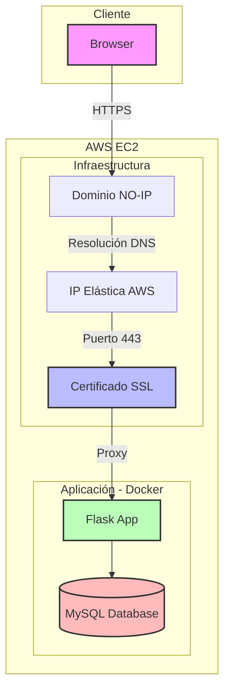
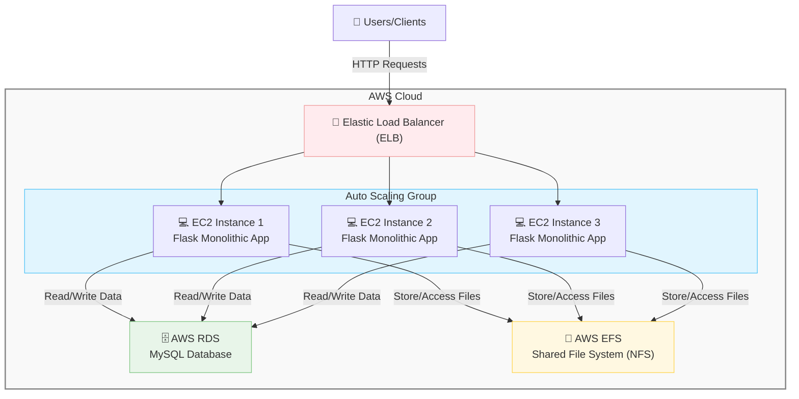

# ST0263 Tópicos Especiales en Telemática - Proyecto 2

## Integrantes

* Alejandro Ríos Muñoz - [ariosm@eafit.edu.co](mailto:ariosm@eafit.edu.co)
* Lina Sofía Ballesteros Merchán - [lsballestm@eafit.edu.co](mailto:lsballestm@eafit.edu.co)
* Jhonnatan Stiven Ocampo Díaz - [jsocampod@eafit.edu.co](mailto:jsocampod@eafit.edu.co)

## Profesor

* Edwin Nelson Montoya Munera - [emontoya@eafit.edu.co](mailto:emontoya@eafit.edu.co)

---

# Índice

1. Descripción del proyecto
 - 1.1 Requerimientos funcionales y no funcionales
 - 1.2 Aspectos no desarrollados
2. Información general
  - 2.1 Diseño de alto nivel
  - 2.2 Arquitectura
  - 2.3 Patrones de diseño
  - 2.4 Buenas prácticas utilizadas
3. Ambiente de desarrollo y técnico
  - 3.1 Lenguajes y tecnologías principales
  - 3.2 Compilación y ejecución
  - 3.3 Detalles del desarrollo
  - 3.4 Estructura del proyecto
  - 3.5 Descripción de los componentes
4. Ambiente de ejecución (Producción)
  - 4.1 Despliegue
  - 4.2 IP o nombre de dominio del servidor
  - 4.3 Mini guía para el usuario final
5. Referencias

---

## 1. Descripción del proyecto

BookStore es una aplicación web de comercio electrónico para la venta de libros de segunda mano, publicada por usuarios registrados. Soporta autenticación, visualización de catálogo, compra, pago y envío simulado.

El proyecto se desarrolló en tres etapas progresivas:

* **Objetivo 1:** Despliegue monolítico en una sola instancia EC2 con Docker, NGINX y Certbot para SSL.
* **Objetivo 2:** Escalamiento horizontal con Auto Scaling Group, RDS, EFS y certificados SSL gestionados con ACM.
* **Objetivo 3:** Reingeniería completa de la aplicación en una arquitectura de microservicios desplegada con Docker Swarm y RabbitMQ.

### 1.1 Requerimientos funcionales y no funcionales

#### Funcionales

* RF01 – Registro, login y logout de usuarios:
El sistema debe permitir a los usuarios crear una cuenta, iniciar sesión de forma segura y cerrar sesión cuando lo deseen. Implementado con autenticación basada en Flask y microservicio independiente en el objetivo 3.

* RF02 – Visualización de catálogo de libros:
Los usuarios deben poder explorar los libros disponibles para la venta, publicados por otros usuarios, sin necesidad de iniciar sesión. El catálogo se gestiona desde una base de datos y es consultado vía API.

* RF03 – Compra de libros (simulada):
El sistema debe permitir que los usuarios agreguen libros al carrito y realicen una compra. Se simula la disponibilidad del stock y la transacción de compra sin pagos reales.

* RF04 – Pago y envío simulado:
Una vez realizado el pedido, se simula el proceso de pago y se registra una orden de entrega con información ficticia, como si el envío fuera gestionado por un proveedor logístico.

* RF05 – Separación de funcionalidades en microservicios (objetivo 3):
El sistema debe estar dividido en microservicios: uno para autenticación, otro para catálogo, y otro para gestión de órdenes y pagos. Cada uno cuenta con su lógica, base de datos y comunicación interna.


#### No funcionales

* RNF01 – Alta disponibilidad:
El sistema debe garantizar la continuidad del servicio incluso ante la caída de una instancia. Esto se logró mediante el uso de múltiples réplicas y balanceadores de carga como ELB y mecanismos de escalado automático.

* RNF02 – Tolerancia a fallos:
La arquitectura debe detectar y recuperarse automáticamente de fallos. Se implementó usando Auto Scaling en AWS para reponer instancias caídas y, en el objetivo 3, con Docker Swarm para reubicar servicios automáticamente en otros nodos.

* RNF03 – Escalabilidad horizontal:
El sistema debe ser capaz de aumentar su capacidad al agregar nuevas instancias. Esto se cumplió mediante grupos de Auto Scaling en el objetivo 2 y servicios replicados en Docker Swarm para el objetivo 3.

* RNF04 – Balanceo de carga:
Las peticiones deben distribuirse equitativamente entre las instancias disponibles. Esto se gestionó mediante el Elastic Load Balancer de AWS en el objetivo 2 y el balanceador interno de Docker Swarm en el objetivo 3.

* RNF04 – Seguridad de la comunicación:
Toda la comunicación debe estar cifrada mediante HTTPS, utilizando certificados SSL generados con Certbot y gestionados por ACM.

* RNF08 – Despliegue automatizado y reproducible:
Se usaron scripts, Dockerfiles, y Docker Compose para facilitar el despliegue automatizado del sistema. Para objetivos 2 y 3 se configuraron Launch Templates, AMIs personalizadas y scripts para reinicio automático.

* RNF09 – Configuración dinámica y modular:
El sistema se organiza en componentes desacoplados, permite escalar, mantener e implementar funcionalidades sin afectar el resto del sistema.

### 1.2 Aspectos NO desarrollados

* No se usó Kubernetes (EKS) por restricciones de la cuenta AWS Academy, en cambio se usó Docker Swarm

---

## 2. Información general

### 2.1 Diseño de alto nivel

* **Monolito (Objetivo 1):**
Una arquitectura cliente-servidor simple donde el cliente accede mediante un dominio personalizado con HTTPS. Un servidor NGINX actúa como proxy inverso hacia una aplicación Flask desplegada en Docker. La lógica del sistema (catálogo, autenticación, pagos) está centralizada, y la base de datos MySQL se ejecuta como contenedor.

- Diagrama de alto nivel:




* **Escalado en la nube (Objetivo 2):**
Arquitectura clásica de 3 capas distribuida en la nube. Las instancias EC2 ejecutan la misma imagen dockerizada del monolito. Se emplea un Auto Scaling Group con políticas de escalado por CPU, un ELB para distribuir tráfico, RDS (Aurora) como base de datos relacional administrada y EFS como sistema de archivos compartido.

- Diagrama de alto nivel:



* **Microservicios (Objetivo 3):**
Se divide la aplicación en microservicios: autenticación, catálogo, órdenes/pagos. Cada uno se ejecuta como un servicio independiente con su propia base de datos. Un API Gateway (Flask) recibe solicitudes REST y las reenvía como llamadas. RabbitMQ asegura la entrega de mensajes cuando hay caídas temporales.

- Diagrama de alto nivel:

[](https://postimg.cc/5H6dFtp6)

### 2.2 Arquitectura

- **Objetivo 1:**
Despliegue monolítico en una instancia EC2, ejecutando un contenedor NGINX y Flask con MySQL. Certificados SSL gestionados por Certbot. Proxy reverso y volúmenes Docker para persistencia.

- Diagrama de Arquitectura:

[](https://postimg.cc/HjSw6stp)

- **Objetivo 2:**
Despliegue escalado automático mediante Auto Scaling Group con instancias EC2 creadas desde una AMI personalizada. Balanceo con ELB, base de datos administrada en RDS (Aurora), sistema de archivos compartido con EFS y certificados SSL gestionados mediante ACM. El tráfico se distribuye entre múltiples instancias activas.

- Diagrama de Arquitectura:

[](https://postimg.cc/2qFcyNNV)

- **Objetivo 3:**
Arquitectura distribuida basada en microservicios desplegados sobre múltiples nodos EC2 orquestados por Docker Swarm. RabbitMQ actúa como middleware para asegurar entrega de eventos. El API Gateway gestiona todas las rutas REST externas.

- Diagrama de Arquitectura:

[](https://postimg.cc/LnXrW5Kv)

### 2.3 Patrones de diseño

* **Microservicios por dominio funcional:** Separación en servicios específicos (auth, catálogo, órdenes).
* **API Gateway:** Centraliza rutas REST y convierte peticiones.
* **Proxy inverso (NGINX):** En el monolito, direcciona tráfico a Flask según puerto.
* **CQRS (Command-Query Responsibility Segregation):** Separa lectura y escritura en órdenes y catálogo.
* **Blueprints (Flask):** Permite modularizar rutas, controladores y lógica.
* **Launch Template + AMI personalizada:** Permite instancias EC2 preconfiguradas listas para escalar.
* **Target Groups y Health Checks:** En el ELB, aseguran balanceo efectivo y desconexión automática de instancias defectuosas.

### 2.4 Buenas prácticas utilizadas

* Contenerización con Docker y Docker Compose
* Orquestación con Docker Swarm
* Creación de AMI personalizada para instancias EC2
* Uso de Launch Templates para autoescalado y replicación
* Configuración de Auto Scaling Group con reglas de CPU
* Uso de Security Groups por tipo de servicio
* Uso de Target Groups en ELB para balancear tráfico entre instancias saludables
* Reingeniería progresiva del monolito hacia microservicios
* Gestión de secretos con Docker Secrets y archivos `.env`
* Modularización de controladores, modelos y plantillas en Flask 
* Estructuración organizada de rutas con Flask (en el Gateway) 

---

## 3. Ambiente de desarrollo y técnico

### 3.1 Lenguajes y tecnologías principales

| Componente         | Tecnología      | Versión    |
| ------------------ | --------------- | ---------- |
| Backend Monolito   | Python + Flask  | 3.9 / 3.1  |
| Base de datos      | MySQL / MariaDB | 8.0 / 10.4 |
| Web Server         | NGINX           | 1.25.3     |
| Certificados SSL   | Certbot / ACM   | Latest     |
| Orquestación       | Docker / Swarm  | 24.0.5     |
| Mensajería (obj 3) | RabbitMQ        | 4.x        |
| Gateway (obj 3)    | Flask        | 0.110.0    |

### 3.2 Compilación y ejecución

A continuación se lista las acciones tomadas en cuenta para la ejecución del proyecto 2:

##  Objetivo 1 - Despliegue App Monolítica

### Requisitos previos

* Instancia EC2 creada (Ubuntu 22.04 LTS)
* IP elástica asociada
* Dominio registrado en [NO-IP](https://www.noip.com/)
* Acceso SSH a la instancia
* Archivos del proyecto listos (carpeta `01-monolithic/` con `Dockerfile`, `docker-compose.yml`, `nginx.conf`) en repositorio de Github

---

### Conectarse a la instancia EC2

```bash
ssh -i "llave.pem" ubuntu@<IP-EC2>
```

---

### Actualizar el sistema e instalar Docker y Docker Compose

```bash
sudo apt update && sudo apt upgrade -y
sudo apt install docker.io docker-compose -y
sudo systemctl enable docker
```

---

###  Clonar el proyecto y ubicarse en el directorio

```bash
git clone <repo> bookstore-ecommerce
cd bookstore-ecommerce/01-monolithic
```

---

### Configurar dominio NO-IP y redirigir tráfico a la IP elástica

* Crear un host tipo A en NO-IP apuntando a la IP pública de la instancia
* Por ejemplo: `bookstoreproject.ddns.net`

---

### Configurar el archivo `nginx.conf`

Ejemplo:

```nginx
...
server {
    listen 80;
    server_name bookstoreproject.ddns.net;

    location / {
        proxy_pass http://flaskapp:5000;
        include /etc/nginx/proxy_params;
    }
}
...
```

---

###  Ejecutar los servicios (Flask + MySQL + NGINX)

```bash
sudo docker-compose up -d --build
```

Esto levanta:

* `db`: contenedor MySQL
* `flaskapp`: contenedor Flask con la app
* `nginx`: contenedor como proxy inverso

---

### Instalar Certbot y generar certificado SSL

```bash
sudo apt install certbot python3-certbot-nginx -y
```

Luego, detener temporalmente el contenedor NGINX:

```bash
sudo docker-compose stop nginx
```

Generar certificado:

```bash
sudo certbot certonly --standalone -d bookstoreproject.ddns.net
```

Certbot ubicará los archivos en `/etc/letsencrypt/live/bookstoreproject.ddns.net/`

---

###  Mapear certificados en `docker-compose.yml`

```yaml
volumes:
  - /etc/letsencrypt:/etc/letsencrypt:ro
```

Y en el `nginx.conf`, añadir sección HTTPS:

```nginx
server {
    listen 443 ssl;
    server_name bookstoreproject.ddns.net;

    ssl_certificate /etc/letsencrypt/live/bookstoreproject.ddns.net/fullchain.pem;
    ssl_certificate_key /etc/letsencrypt/live/bookstoreproject.ddns.net/privkey.pem;

    location / {
        proxy_pass http://flaskapp:5000;
        include /etc/nginx/proxy_params;
    }
}
```

---

### Levantar servicios nuevamente con SSL configurado

```bash
sudo docker-compose up -d
```

---

### Verificar funcionamiento

* Acceder desde navegador:
  `https://bookstoreproject.ddns.net`

* Verificar que carga la app Flask protegida con HTTPS

* Verificar los contenedores con:

```bash
docker ps
```

---

## Objetivo 2 – Despliegue Escalable en AWS

### Prerrequisitos

* Haber completado el Objetivo 1 (AMI lista con la app monolítica dockerizada)
* Certificado SSL creado en AWS Certificate Manager (ACM)
* Dominio configurado en Route 53 o NO-IP redirigido al Load Balancer
* IAM Role con permisos para EC2, Auto Scaling, RDS, EFS, ELB

---

###  Crear una AMI desde la instancia del Objetivo 1

1. Detener la instancia EC2 de tu app monolítica.
2. Desde la consola de EC2 → `Actions > Image > Create Image`.
3. Nombrar como: `bookstore-monolith-image`.
4. Espera a que se cree la imagen (ver en sección “AMIs”).

---

###  Crear un Launch Template

1. Ir a EC2 → Launch Templates → `Create launch template`.
2. Seleccionar la AMI creada anteriormente.
3. Elegir tipo de instancia (ej: `t2.medium`).
4. Asociar:

   * Un security group que abra puertos 80, 443, 3306 (RDS) y 2049 (para EFS).
   * IAM Role con permisos necesarios.
   * Asignar volumen persistente.
   * Setup de userdatapara montar EFS:

```bash
#!/bin/bash
sudo apt update
sudo apt install -y nfs-common
sudo mkdir -p /mnt/efs
sudo mount -t nfs4 -o nfsvers=4.1 fs-XXXXXX.efs.REGION.amazonaws.com:/ /mnt/efs
```

---

### Crear un Application Load Balancer (ALB)

1. Ir a EC2 → Load Balancers → `Create Load Balancer`.
2. Elegir Application Load Balancer.
3. Configura:

   * Listener HTTP (puerto 80) y HTTPS (puerto 443 con certificado ACM).
   * Asociar al menos dos subredes públicas.
   * Security Group que permita tráfico HTTP y HTTPS.
4. Crear un Target Group con tipo “instance” (puerto 80).
5. Al terminar, guardar el DNS del ALB (ej: `bookstore-alb-1234.elb.amazonaws.com`).

---

###  Crear un Auto Scaling Group (ASG)

1. Ir a EC2 → Auto Scaling Groups → `Create Auto Scaling Group`.
2. Asociar el Launch Template creado antes.
3. En Networking, elegir subredes privadas.
4. En Attach to Load Balancer, seleccionarel ALB y Target Group.
5. Definir políticas de escalado

---

### Crear e integrar RDS (Aurora MySQL)

1. Ir a RDS → `Create database`.
2. Elegir Aurora MySQL.
3. Definir parámetros:

   * Base de datos: `bookstore_db`
   * Usuario: `admin`, contraseña segura
   * Habilitar Multi-AZ si es requerido
   * Conectar a la misma VPC
   * Habilitar acceso desde las instancias EC2 (security group con puerto 3306)
4. Anotar endpoint RDS.

---

###  Crear e integrar EFS

1. Ir a EFS → `Create file system`.
2. Security group debe permitir acceso NFS (puerto 2049).
3. En cada instancia EC2 (desde Launch Template), montar:

```bash
sudo apt install nfs-common -y
sudo mkdir /mnt/efs
sudo mount -t nfs4 -o nfsvers=4.1 fs-XXXX.efs.REGION.amazonaws.com:/ /mnt/efs
```
---

## Objetivo 3 – Despliegue de Microservicios con Docker Swarm

Este objetivo consistió en una reingeniería  de la app monolítica para convertirla en una arquitectura de microservicios desacoplados y desplegarla de forma distribuida en AWS utilizando Docker Swarm.

---

###  Reingeniería de la aplicación

1. **División del monolito** en tres microservicios independientes:

   * `auth-service`: gestión de autenticación y usuarios
   * `catalog-service`: gestión del catálogo de libros
   * `order-service`: gestión de compras, pagos y envíos simulados

2. **Separación de código y responsabilidades**:

   * Cada servicio tiene su propio `Dockerfile`, lógica, base de datos y rutas

3. **Creación del API Gateway**:

   * Implementado en **Flask**
   * Recibe peticiones REST del cliente
   * Enruta internamente a cada microservicio

4. **Pruebas en entorno local**:

   * Ejecutar `docker-compose` local para validar microservicios por separado
   * Validar comunicación entre servicios
   * Confirmar que el Gateway responde a solicitudes REST y las enruta correctamente

---

###  Preparar el entorno de producción (AWS)

1. **Crear mínimo 3 instancias EC2 (Ubuntu 22.04)**:

   * Una para el **manager**
   * Dos como **workers**
   * Todas conectadas a la misma VPC y grupo de seguridad (abrir puertos: 2377 TCP, 7946 TCP/UDP, 4789 UDP, 8080 REST, 5672 RabbitMQ)

2. **Instalar Docker en cada instancia**:

```bash
sudo apt update
sudo apt install -y docker.io
sudo systemctl start docker
sudo systemctl enable docker
```

3. **Despliegue distribuido con Docker Swarm**

Tras la reingeniería del monolito, se implementó una arquitectura de microservicios desplegada sobre un clúster Docker Swarm con múltiples nodos EC2. El proceso se realizó en las siguientes fases:

---

###  Preparación y configuración de entorno

#### Crear un **Security Group** para el clúster Docker Swarm

Abrir los siguientes puertos para todas las instancias EC2:

| Protocolo | Puerto(s)   | Uso                           |
| --------- | ----------- | ----------------------------- |
| TCP       | 2377        | Gestión del clúster Swarm     |
| TCP       | 7946        | Comunicación entre nodos      |
| UDP       | 7946        | Comunicación entre nodos      |
| UDP       | 4789        | Overlay network (VXLAN)       |
| TCP       | 5000-5003   | Microservicios                |
| TCP       | 8080        | API Gateway REST              |
| TCP       | 5672, 15672 | RabbitMQ                      |
| TCP       | 3306        | Base de datos MariaDB         |

---

#### Crear 3 instancias EC2

* Tipo: `t2.medium`
* Disco: `gp3` de 16 GiB
* Mismo Security Groupy VPC


####  Hacer que el usuario pueda usar Docker sin `sudo`

```bash
sudo usermod -a -G docker ubuntu
```

####  En el nodo **manager**

```bash
docker swarm init
```

#### Obtener el token de unión

```bash
docker swarm join-token manager  # (o worker si deseas nodos worker)
```

#### Ejecutar el token en cada nodo restante

Pega el comando que te devuelve el paso anterior en los otros dos nodos EC2.

#### Verificar los nodos del clúster (desde el manager)

```bash
docker node ls
```

#### Definir usuario Docker Hub 

```bash
export DOCKER_USERNAME=usuario_dockerhub
```

#### Clonar el repositorio

```bash
git clone https://github.com/alejoriosm04/bookstore-ecommerce.git
cd bookstore-ecommerce/03-microservices-scaling/
```

#### Dar permisos al script de despliegue

```bash
chmod +x swarm-deploy.sh
```

####  Ejecutar el despliegue

```bash
sudo -E ./swarm-deploy.sh
```

### 3.3 Detalles del desarrollo

* La app Flask usa Blueprints, SQLAlchemy, y Jinja2
* Scripts para iniciar servicios en segundo plano en instancias EC2
* Configuración persistente de volúmenes Docker y secretos

### 3.4 Estructura del proyecto

```
bookstore-ecommerce/
├── 01-monolithic/
│   ├── controllers/
│   ├── models/
│   ├── templates/
│   ├── app.py
│   └── docker-compose.yml
├── 02-monolithic-scaling/
│   ├── launch-template.sh
│   ├── terraform/
│   └── efs-mount/
└── 03-microservices-scaling/
    ├── api-gateway/
    ├── microservices/
    │   ├── auth-service/
    │   ├── catalog-service/
    │   └── order-service/
    └── docker-compose.yml
```

### 3.5 Descripción de los componentes

* **Monolito (Objetivo 1):**
  Aplicación desarrollada con Flask, estructurada de forma modular para separar las funcionalidades por dominio (autenticación, catálogo, pagos, entregas y administración).

  * Se ejecuta con `docker-compose` y se conecta a un contenedor MySQL.
  * Incluye sistema de templates y gestión de sesión de usuarios autenticados.
  * El servidor NGINX funciona como proxy inverso para enrutar el tráfico HTTP/HTTPS a la aplicación Flask (puerto 5000).
  * Certificados SSL generados mediante Certbot.
  * Persistencia de datos mediante volumen Docker y credenciales definidas por variables de entorno.

---

* **Escalado en la nube (Objetivo 2):**
  Se utilizó una AMI personalizadapara desplegar la imagen Dockerizada del monolito en múltiples instancias EC2 mediante un Auto Scaling Group, asegurando alta disponibilidad.

  * El balanceador de carga distribuye el tráfico.
  * Se montó un sistema de archivos compartido EFS para permitir acceso común a archivos estáticos entre todas las instancias.
  * La base de datos fue migrada a un servicio RDS Aurora, asegurando replicación y gestión centralizada.
  * Certificados SSL gestionados por AWS Certificate Manager (ACM) y asociados al LB.
  * Se utilizaron Launch Templates y políticas de escalado automático configuradas por capacidad deseada.

---

* ** Microservicios (Objetivo 3):**
  Reingeniería completa de la app monolítica para dividirla en tres microservicios independientes, desplegados con Docker Swarm sobre múltiples nodos EC2:

  * `auth-service`: gestiona el registro, login y logout de usuarios. Mantiene su propia base de datos y se comunica con el Gateway
  * `catalog-service`: permite la visualización y gestión del catálogo de libros disponibles en la plataforma.
  * `order-service`: maneja la creación de pedidos, verificación de stock, simulación de pago y asignación de proveedor de envío.

  Además:

  * **API Gateway** desarrollado en **Flask**, actúa como punto único de entrada para solicitudes REST, convirtiéndolas a llamadas hacia los servicios internos.
  * Se implementó **RabbitMQ** como sistema de mensajería asincrónico para tolerancia a fallos: si un microservicio está caído, el mensaje se encola hasta que se restablezca.
  * Cada servicio corre como contenedor replicado en el clúster.
  * Se utilizó un script automatizado (`swarm-deploy.sh`) para levantar todos los servicios en el clúster.
  * Las configuraciones sensibles (como contraseñas y endpoints) se manejan con `.env` y secretos en Docker.

---
## 3.6 Resultados y pantallazos


## 4. Ambiente de ejecución

### Objetivo 1

* Desplegado en EC2 con Docker Compose
* Dominio personalizado con NO-IP y certificado SSL generado con Certbot
* Flask y MySQL como contenedores

### Objetivo 2

* Auto Scaling Group con AMI personalizada
* ELB como balanceador de carga
* RDS Aurora como base de datos administrada
* EFS como sistema de archivos compartido
* Certificado SSL gestionado con ACM

### Objetivo 3

* Despliegue distribuido con Docker Swarm
* API Gateway Flask 
* RabbitMQ para mensajes asincrónicos
* Cada microservicio con su propia base de datos
---

### 4.3 Mini guía para el usuario final

La aplicación BookStore permite a los usuarios autenticarse, explorar libros disponibles para la venta, simular una compra y realizar el proceso de envío de forma ficticia. A continuación, se describen los pasos funcionales:

1. **Registro y autenticación de usuarios:**

   * Los usuarios pueden crear una cuenta mediante el formulario de registro (`/register`).
   * Luego pueden iniciar sesión en la plataforma con sus credenciales (`/login`).
   * Una vez autenticados, pueden acceder a funcionalidades como comprar libros o ver libros.

2. **Exploración del catálogo de libros:**

   * El catálogo es accesible y muestra todos los libros disponibles publicados.
   * Cada libro presenta información relevante como cantidad disponible.
   * En el objetivo 3, esta funcionalidad está desacoplada y gestionada por el `catalog-service`.

3. **Agregar libros al carrito y realizar compras:**

   * Los usuarios autenticados pueden seleccionar libros del catálogo y comprar.
   * Pueden proceder al checkout donde se valida el stock y se crea un pedido.
   * En el monolito (objetivo 1 y 2) este proceso es directo, mientras que en el objetivo 3 se realiza a través de `order-service` y eventos vía RabbitMQ.

4. **Verificación de stock, simulación de pago y entrega:**

   * Al realizar el pedido, el sistema verifica la cantidad disponible del libro.
   * Si hay disponibilidad, se genera un pedido y se reduce el stock en la base de datos.
   * El pago es simulado, y se registra la orden como realizada.

---

## 5. Referencias
* [AWS Documentation](https://docs.aws.amazon.com/)
* [Docker Documentation](https://docs.docker.com/)
* [Flask Microservices](https://flask.palletsprojects.com/)
* [RabbitMQ Docs](https://www.rabbitmq.com/documentation.html)
* [Certbot](https://certbot.eff.org/)
- [Cursor AI](https://www.cursor.com/)
- [ChatGPT](https://chatgpt.com/)
- Diapositivas de clase - *Tópicos Especiales en Telemática ST0263*: Material académico de referencia utilizado durante el desarrollo del proyecto.
* Repositorio base: [https://github.com/st0263eafit/st0263-251/blob/main/proyecto2/BookStore.zip](https://github.com/st0263eafit/st0263-251/blob/main/proyecto2/BookStore.zip)
